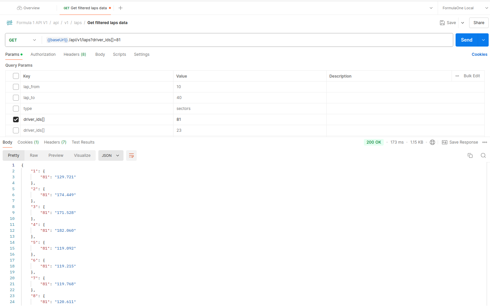
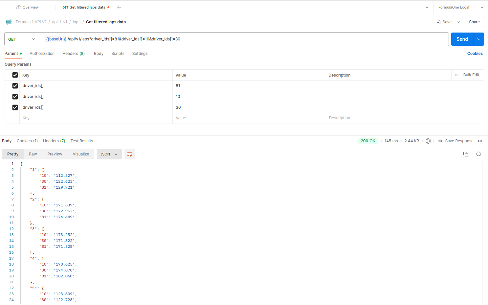
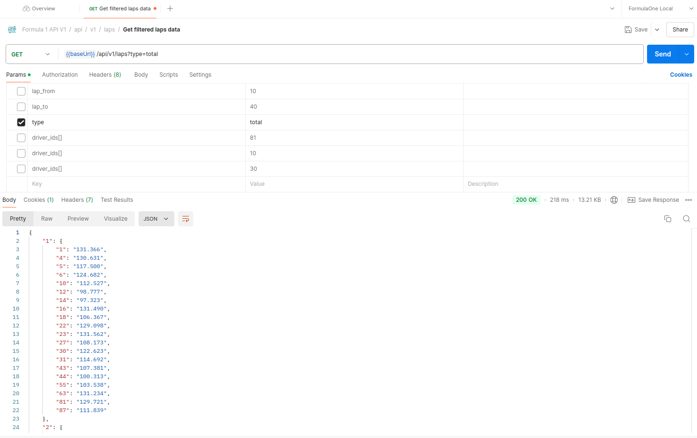
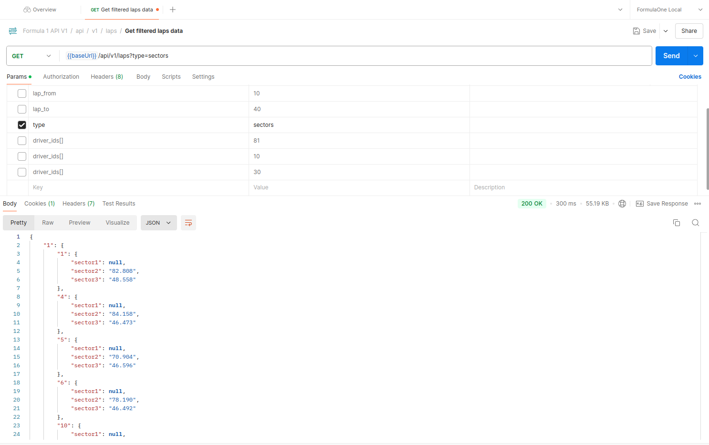
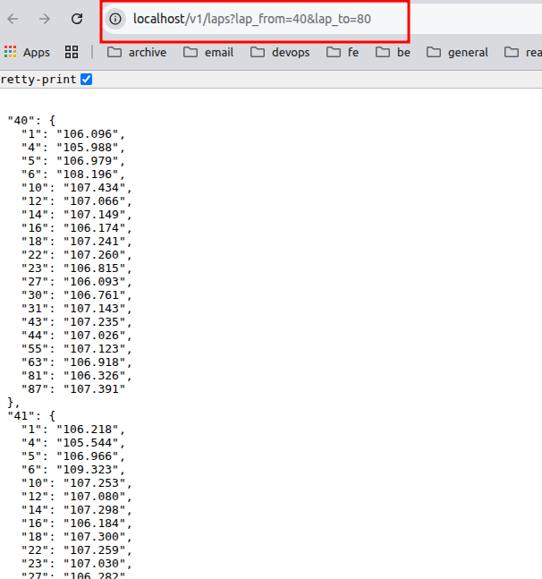
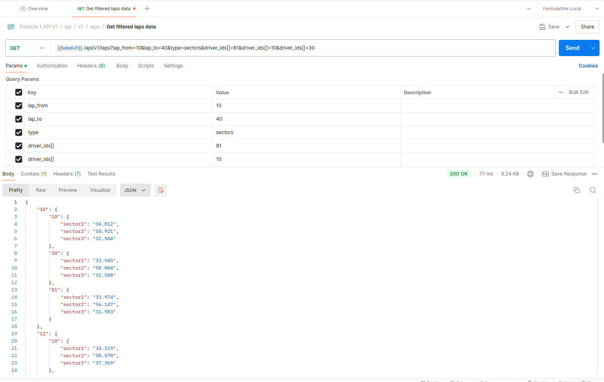

# Formula 1 API

## Installation
**1)** Clone repo https://github.com/sharp-mdm/formula1.git

**2)** Copy `.env.example` to `.env` in project root.

**3)** Run installation use command `make install`

- During installation check MySql storage and press enter.
- Wait installation process.
- Click link in CLI which will open browser page for make sure the application is running correctly.

**4)** After installation, use the commands `make up` and `make stop` to run or stop the project in the future.

**5)** To run the import in test mode, use the command `sail php artisan schedule:test`

**6)** Run the tests using `make test`

### Examples
1) http://localhost/v1/laps?driver_id[]=81

2) http://localhost/v1/laps?driver_id[]=81&driver_id[]=10&driver_id[]=30

3) http://localhost/v1/laps?type=total (default behavior)

4) http://localhost/v1/laps?type=sectors

5) http://localhost/v1/laps?lap_from=40&lap_to=80

6) http://localhost/v1/laps?lap_from=10&lap_to=40&type=sectors&driver_id[]=87&driver_id[]=23&driver_id[]=5

